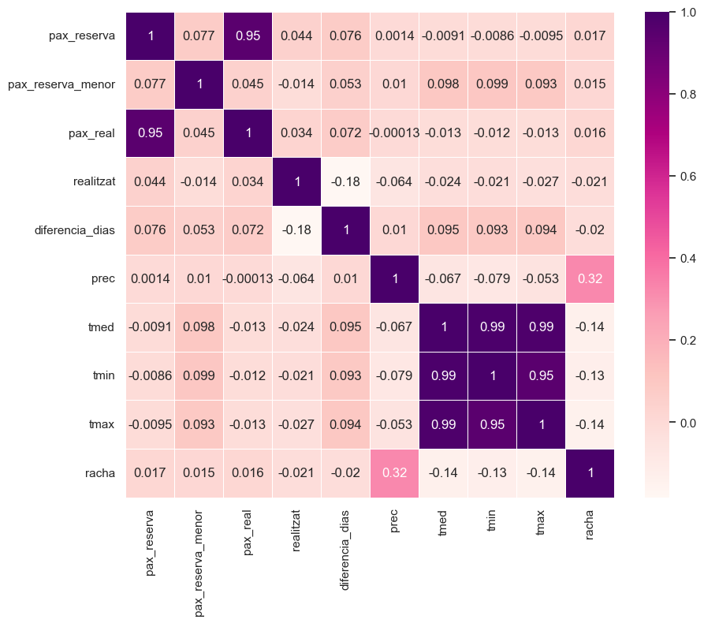

# BARKENO-PROJECT

**.INTRODUCCIÓN:**

This project arises in response to a real need of a company, using the magic of data, I have been able to provide solutions to their problems.
Let's set the stage. Barkeno is a company that offers tours in the city of Barcelona, with different routes, such as the old town, the modernist route, among others. It operates through online reservations made by tourists on various platforms. The absence of costs associated with reservations reduces their compulsory nature.
In March 2023, a municipal regulation was enacted that regulated tourist activity and established certain limitations, such as reducing the number of groups in specific tourist locations and limiting them to a maximum of 20 people per group. This restriction posed a problem for the company as they faced the challenge of managing reservations for people who ultimately do not show up. In response to this new regulation, they were forced to limit the number of reservations that could be made per day, closing the possibility of making more reservations on the platforms, in addition to leaving an additional margin to address these possible cancellations.
Within this context, the company is seeking a solution that will allow them to anticipate and manage canceled reservations more efficiently, with the goal of optimizing their overbooking system.
The company was founded in 2019, and its database was established from 2021. Recently, they have provided us with a file containing over 130,000 reservation records, spanning from April 2021 to 2024. This database includes detailed information, such as the number of people per reservation, the number of people who actually attended the tour, the reservation date, the visit date, the tour route, language, visit time, reservation platform, and a variable indicating whether the visit was completed or not. In addition, the database contains other personal data that has not been provided to us for legal data protection reasons, and we will discuss this further.
  

**DATA EXPLORATION:**

The database has a mismatch in a couple of columns, but they have been aligned in the same Excel file.
I start working on the file in Python; there are not many missing values, so I decide to delete them as they do not represent a significant volume that would affect the analysis. There are no duplicate values.
Subsequently, I proceed with the database preparation. I consider that I have few variables for analysis and decide to create new ones. I create a variable called "difference in days," which is the result of the difference between the visit date and the reservation date. This way, I can analyze if there is any influence of the time that elapses between the reservation and the visit on the likelihood that the visit takes place or not.

With the two date variables, I decide to split them into year, month, and day, and I also incorporate other variables that represent the day of the week for each date. This way, I can analyze if there is any attendance trend or pattern on different days of the week.

I replace the encoding of the tour types and reservation platforms since they are coded in the database. I assign them their corresponding names. I group some scattered times; for example, if I have a time variable recorded as "10:04," I replace it with "10:00," and I delete times with less than 30 records.

I believe it's important to add variables to the model. Since these tours are conducted outdoors, weather conditions can be interesting to include in the analysis. I download a database through an API that provides daily records of precipitation, temperature, and wind gusts.

I decide to create a MySQL database to enable fast queries and to merge it with my original data frame. Once the structure is created, I combine the databases. The temperature, wind gust, and precipitation measurements have diverse records, so I decide to group them into subcategories divided by ranges. For instance, the temperature variables would be categorized as very hot, cold, temperate, etc. I do the same with the other two variables, transforming them into categorical variables to simplify and organize the analysis.

I notice that the API has a gap in its records for a period of dates, and the database reduces in size after joining. However, the data that aligns is sufficient to continue the analysis.

With all these aggregations and transformations, I obtain a data frame with 59,298 entries and 25 columns.

  

**CORRELATION ANALYSIS**
  

The variables with the highest correlation are the three temperature variables: maximum, average, and minimum. Therefore, I decide to keep the average temperature.

The variables "pax_reserva" and "pax_real" are correlated, but it's essential to analyze both since one represents the number of people per reservation, and the other represents the number of people who attend the visit. I consider transforming one of the variables to derive the information from both. Therefore, I create a new column called "number of non-attendees," which is the difference between the two columns, and I discard the "pax_reserva" column.

In this chart, you can see that correlated variables have been removed.

I create box plots for the variables to identify outliers and discover that the "difference in days" variable has a higher number of outliers. I treat this variable by limiting the interquartile range, keeping only positive values. I graph the distribution and notice it follows an exponential distribution, so I consider applying a logarithmic reduction.

I decide not to normalize or scale the numerical data and instead transform the categorical variables into dummy variables.
With the transformed data frame, I decide to run my first model.

  

<strong>MODELS</strong>

**1st Model** RANDOM FOREST.
  
I apply a Random Forest Classifier with grid search.

Accuracy: 0.7417066155321189

Recall: 0.9809471965160588

Confusion Matrix:

|  528    |  2554  |

|  140    |  7208  |

These are my initial results. I see that the model's performance is not good enough; it has difficulty predicting category 0, which represents visits not completed. Based on these results, I believe I need to adjust the model. Before attempting a second model, I examine the variable importance, and I notice that "difference in days" is an important variable.

  

**2nd Model** RANDOM FOREST - CATEGORIZATION.
  
I decide to apply a new transformation to the "difference in days" variable. In this case, I categorize it into groups, such as less than one week, more than one week, less than one month, more than one month, etc. With this new categorization, I convert them into dummy variables. I run another Random Forest model with a grid search to determine the optimal hyperparameters for the model.
  
Accuracy: 0.7448566610455312

Recall: 0.9761024882976103
  
Confusion Matrix:

|  910    |  2832  |

|  194    |  7924  |

This second model improves the identification of visits that were not completed, but the results are still improvable.

  

**3rd Model** RANDOM FOREST - SMOTE.
  
In this third model, I maintain the categorization of the "difference in days" variable. Additionally, I address the imbalance in the categories (completed, not completed visits). I should note that I hadn't balanced the data before because I considered a 70-30 distribution acceptable.

Accuracy: 0.9418212478920742

Confusion Matrix:

|  3392    |  350  |

|  340     |  7778  |

This final model indeed shows better results, reducing the detection of false negatives and false positives. The prediction of "yes" and "no" is more balanced.

Future lines of research could incorporate the data I mentioned earlier that wasn't provided due to data protection, such as nationality, gender, among others. This could make the prediction model more robust.

  

<strong>BUSINESS INSIGHTS</strong>

I create a time series chart, which reveals reservation peaks that coincide with Easter. The Gothic tour has the highest number of reservations, followed by the modernist tour. The portal that generates the most reservations accounts for 62.91% of the total, with a significant lead over the second portal at 17.90%.

The Gothic neighborhood tour is the most requested and also has the highest number of completed visits. 

The majority of reservations have a "difference in days" of less than one week, and the trend is that the longer the time between reservation and visit, the more likely the reservation won't be completed.

Regarding the months of high activity, April and August represent the peak tourist season. It's worth noting that September is the month where the percentage of attendees and non-attendees is not significantly different.

More graphics here:
https://public.tableau.com/app/profile/rodrigo.rivero2938/viz/BARKENOPROJECT/Historia1